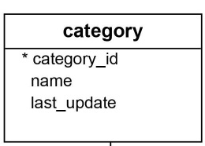
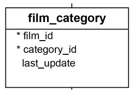
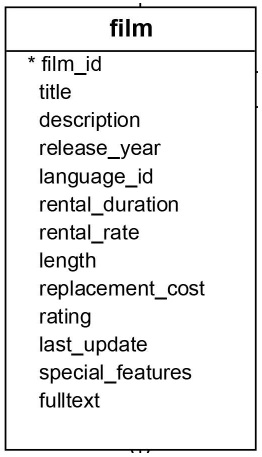

# dvdrental


### ER Diagram


### 1.Code to select a category 'name' by using 'film_id'
```
select name from category where category_id in (select category_id from film_category where film_id =133);
```

### 2.Code to select name from  category and last_update from film_category table 
```
select category.name as Category_Name,film_category.last_update as Film_LastUpdate from category INNER JOIN film_category ON category.category_id = film_category.category_id;
```
### 3.code to select lastupdate from category table and lastupdate from film_category
```
select category.name ,category.last_update as cat_last_update,
film_category.last_update as film_cate_lastupdate from category inner join film_category on
category.category_id =film_category.category_id
```
### 4.query category_id using the category "Action"

```
select category_id from category where name ='Action'
```
### 5.select action films in film_category table
 
```
select film_id from film_category where category_id in (select category_id from category where name ='Action')
```
### 6.select all the films  which are action films
  

```
select * from film where film_id in (select film_id from film_category where category_id in (select category_id from category where name ='Action'))
```
### 7.select category id of Animation Movies
```
select category_id from category where name ='Animation'
```
### 8.select film_id of Animation Movies
```
select film_id from film_category where category_id in (select category_id from category where name ='Animation')
```
### 9.Select title from film of category Animation
```
select title from film where film_id in (select film_id from film_category where category_id in (select category_id from category where name ='Animation'))

```
### 10.Select film_id from 25 to 30
```
select * from film where film_id >=25 and film_id <=30 
```
### 11.Query to get all films starting in 'A'
```
select * from film where title like 'A%'
```
### 12.Query films that start with 'A' & ends with r
```
select * from film where title like 'A%r'
```
### 13.select title with second letter has r
```
select * from film where title like '_r%'
```
### 14.select title with second letter has r and category as Animation
```
select * from film where title like '_r%' and film_id in (select film_id from film_category where category_id in (select category_id from category where name ='Animation'))

```
### 15.No of RRows while selecting title with second letter has r and category as Animation 
```
select Count(title) from film where title like '_r%' and film_id in (select film_id from film_category where category_id in (select category_id from category where name ='Animation'))
```
### 14.Average of rental_rate from tables where second letter r and category as animation.
```
select Avg(rental_rate) from film where title like '_r%' and film_id in (select film_id from film_category where category_id in (select category_id from category where name ='Animation'))
```
### 15.Query to get all the film acted by actor penelope Guiness
```
select * from film where film_id in (select film_id from film_actor where actor_id in (select actor_id from actor where first_name='Penelope' and last_name='Guiness'))
```
