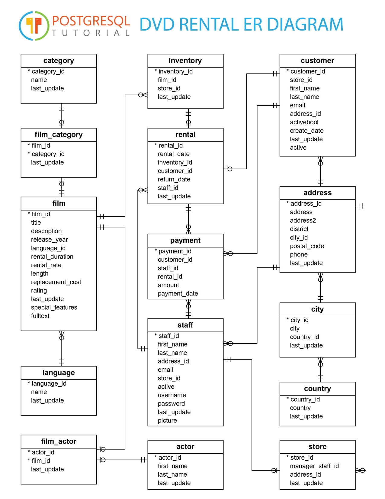

# dvdrental


### Code to select a category 'name' by using 'film_id'
```
select name from category where category_id in (select category_id from film_category where film_id =133);
```

### Code to select name from  category and last_update from film_category table 
```
select category.name as Category_Name,film_category.last_update as Film_LastUpdate from category INNER JOIN film_category ON category.category_id = film_category.category_id;
```

